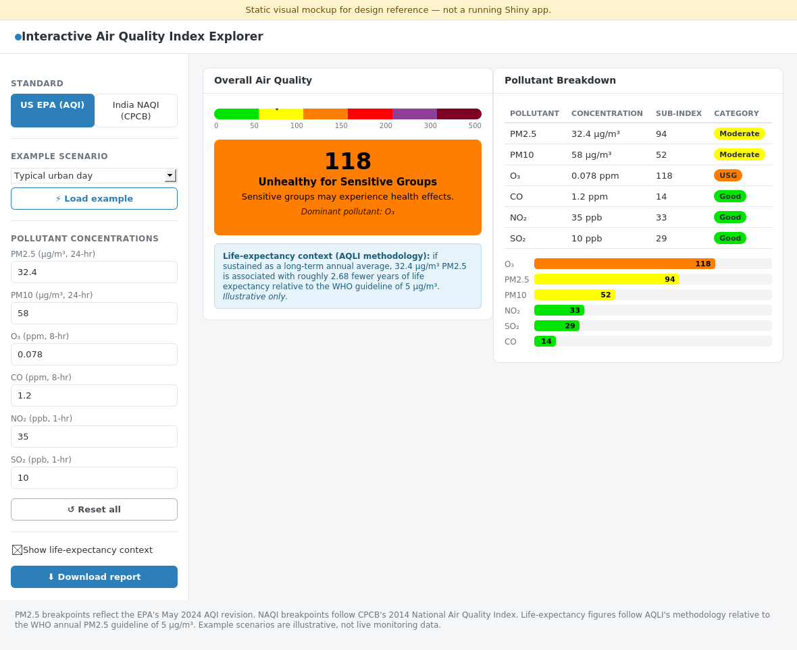
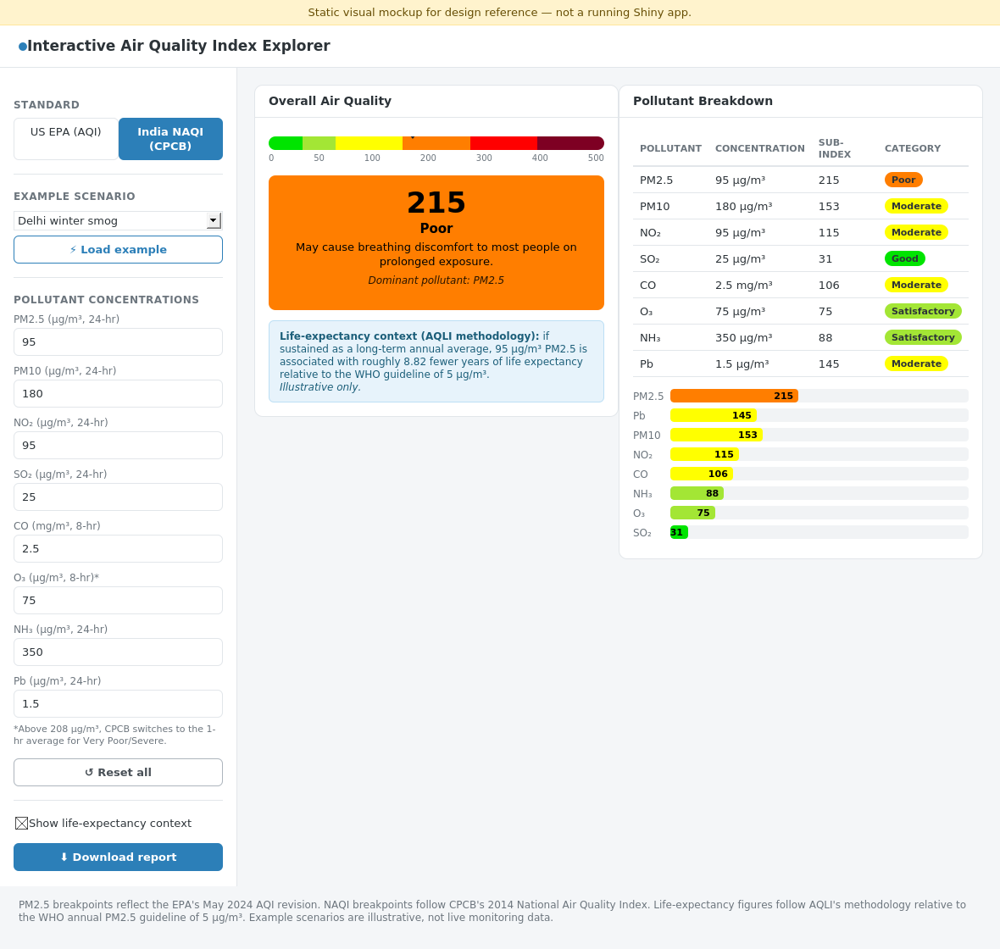

# Interactive Air Quality Index (AQI) Explorer

A single-file R Shiny app that turns raw pollutant concentrations into a
composite Air Quality Index under two national standards — the **US EPA
AQI** and **India's NAQI (CPCB)** — with a live gauge, a color-coded
pollutant breakdown, and optional life-expectancy context drawn from the
[Air Quality Life Index (AQLI)](https://aqli.epic.uchicago.edu/) methodology.

|                          EPA mode                          |                         CPCB mode                          |
| :----------------------------------------------------------: | :----------------------------------------------------------: |
|             |           |

> The screenshots above are a static design mockup (HTML/CSS), built to
> match the app's actual `bslib` theme and colors exactly, for preview
> purposes in this README. The live app renders the gauge as a circular
> Plotly dial rather than the horizontal scale shown here — everything
> else (layout, colors, table, chart) matches what running the app produces.

---

## Contents

- [What it does](#what-it-does)
- [Features](#features)
- [Standards and methodology](#standards-and-methodology)
- [Getting started](#getting-started)
- [Deploying to shinyapps.io](#deploying-to-shinyappsio)
- [Project structure](#project-structure)
- [How the code is organized](#how-the-code-is-organized)
- [Limitations and disclaimers](#limitations-and-disclaimers)
- [Sources](#sources)
- [License](#license)

---

## What it does

You enter measured (or hypothetical) concentrations for a set of pollutants,
and the app:

1. Converts each concentration into a pollutant-specific **sub-index** using
   the official piecewise-linear breakpoint formula.
2. Reports the **composite index** as the maximum of those sub-indices (both
   the EPA AQI and CPCB's NAQI are defined this way — the single worst
   pollutant drives the headline number).
3. Shows which pollutant is **dominant**, what health **category** and
   **advisory** apply, and — for PM2.5 — an optional note on what that
   concentration implies for life expectancy if sustained long-term.

It updates live as you type (no "Calculate" button), and everything —
labels, units, breakpoints, colors — swaps automatically when you switch
between the EPA and CPCB standards in the sidebar.

## Features

- **Two standards, one app** — US EPA AQI and India NAQI (CPCB), each with
  the correct pollutant set, units, breakpoints, and category thresholds.
  CPCB adds NH₃ and Pb, which the EPA standard doesn't use.
- **Live, reactive calculation** — results update as you type; no button to
  click.
- **Example scenarios** — one-click presets (e.g. "Delhi winter smog",
  "Wildfire smoke") to explore the tool without hunting for real data.
  These are illustrative, not live monitoring data.
- **Interactive gauge** — a Plotly dial showing the composite index against
  all six category bands.
- **Color-coded, sortable breakdown table** (`DT`) showing every pollutant's
  concentration, sub-index, and category.
- **Interactive bar chart** (`ggplot2` + `plotly`) with hover tooltips.
- **Dominant pollutant + plain-language health advisory** for the current
  composite category.
- **Off-scale handling** — a reading above the top breakpoint is reported as
  "500+ (beyond scale)" rather than being silently blank.
- **CPCB minimum-data rule** — CPCB requires ≥3 pollutants, including PM2.5
  or PM10, for a valid composite figure; the app flags results as
  indicative-only when that isn't met, instead of silently reporting a
  number as if it were fully valid.
- **AQLI life-expectancy context** *(optional, toggle in the sidebar)* — for
  a given PM2.5 reading, estimates years of life expectancy relative to the
  WHO guideline (5 µg/m³), based on Ebenstein et al. (2017): ~0.098 years
  per µg/m³. Clearly labeled as illustrative, since it assumes the entered
  value is a sustained annual average.
- **Downloadable report** — a plain-text summary of all entered pollutants,
  sub-indices, and the composite result.

## Standards and methodology

### US EPA AQI

Breakpoints reflect the **EPA's May 2024 AQI revision** (the PM2.5 "Good"
threshold dropped from 12.0 to 9.0 µg/m³, and the upper categories were
tightened). PM10, O₃, CO, NO₂, and SO₂ breakpoints are unchanged from the
2012 table.

| Category | AQI range |
|---|---|
| Good | 0–50 |
| Moderate | 51–100 |
| Unhealthy for Sensitive Groups | 101–150 |
| Unhealthy | 151–200 |
| Very Unhealthy | 201–300 |
| Hazardous | 301–500 |

### India NAQI (CPCB)

Breakpoints follow CPCB's 2014 National Air Quality Index framework, which
uses **non-uniform category widths** (unlike the EPA's mostly-50-point
bands) and an **eight-pollutant set**: PM2.5, PM10, NO₂, SO₂, CO, O₃, NH₃,
and Pb.

| Category | AQI range |
|---|---|
| Good | 0–50 |
| Satisfactory | 51–100 |
| Moderate | 101–200 |
| Poor | 201–300 |
| Very Poor | 301–400 |
| Severe | 401–500 |

A composite NAQI value is only meaningful with data for **≥3 pollutants,
including PM2.5 or PM10** — the app enforces this and flags the result as
indicative-only otherwise. Note also that CPCB's O₃ sub-index uses the
8-hour average up to 208 µg/m³, then switches to the **1-hour** average for
the Very Poor/Severe bands — a quirk called out next to the O₃ input field
when CPCB is selected.

### AQLI life-expectancy context

The optional note under the gauge uses the relationship established in
Ebenstein et al. (2017) and used throughout AQLI's published indices:
sustained exposure to an additional 10 µg/m³ of PM2.5 is associated with a
**0.98-year reduction in life expectancy**, i.e. ~0.098 years per µg/m³,
measured relative to the WHO's annual PM2.5 guideline of 5 µg/m³. This
coefficient is derived from long-term **annual average** exposure — the app
says so explicitly, since a single reading entered here is not the same
thing as a sustained annual average.

## Getting started

**Requirements:** R ≥ 4.1 (the app uses the native pipe `|>`) and the
following packages:

```r
install.packages(c("shiny", "bslib", "ggplot2", "plotly", "DT"))
```

`bslib` must be ≥ 0.5 for `page_sidebar()`, `sidebar()`, `card()`, and
`layout_columns()` — if you have an older version installed:

```r
install.packages("bslib")
```

**Run locally:**

```r
shiny::runApp("app.R")
```

or open `app.R` in RStudio and click **Run App**.

## Deploying to shinyapps.io

shinyapps.io doesn't take a direct file upload — deployment goes through the
`rsconnect` package, which bundles and pushes the app from your local R
session:

```r
install.packages("rsconnect")

# One-time setup — get these values from shinyapps.io → Account → Tokens
rsconnect::setAccountInfo(name = "<account>", token = "<token>", secret = "<secret>")

# From inside this project's folder:
rsconnect::deployApp()
```

`rsconnect::deployApp()` scans your local package versions to decide what to
bundle, so make sure everything under [Getting started](#getting-started) is
installed and up to date *locally* before deploying.

## Project structure

```
aqi-explorer/
├── app.R                   # the entire app: data, UI, and server logic
├── README.md                # this file
├── LICENSE                  # MIT
├── .gitignore
└── screenshots/
    ├── epa-mode.png
    └── cpcb-mode.png
```

## How the code is organized

`app.R` is a single file, structured top to bottom as:

1. **Helpers** — `truncate_to()`, `calc_subindex()`, `get_category()`. Pure
   functions, standard-agnostic, used by both EPA and CPCB logic.
2. **`standards`** — a nested list that is the single source of truth for
   *everything* standard-specific: category bands, colors, advisory text,
   and per-pollutant breakpoints/units/precision. Adding a pollutant,
   correcting a breakpoint, or adding an entirely new national standard
   means editing only this section — the UI and server code read from it
   generically and don't hardcode pollutant names anywhere else.
3. **`presets`** — example scenarios for the sidebar dropdown.
4. **UI** — a `bslib` sidebar (standard selector, presets, pollutant inputs,
   reset/download) plus a two-card main layout (gauge/summary, table/chart).
5. **Server** — a small reactive pipeline:
   `results()` (per-pollutant sub-indices) → `overall()` (composite index +
   dominant pollutant + CPCB sufficiency check) → render functions for the
   gauge, banner, table, chart, and downloadable report.

## Limitations and disclaimers

- This tool is for **exploration and education**, not regulatory or
  clinical use. Always confirm figures against the official
  [AirNow](https://www.airnow.gov/) (EPA) or [CPCB](https://cpcb.nic.in/)
  sources before relying on them.
- Example/preset scenario values are illustrative approximations, not
  real recorded monitoring data for the named locations.
- The AQLI life-expectancy note assumes the entered PM2.5 value represents
  a sustained annual average — treat it as illustrative context, not a
  personalized health estimate.
- CPCB's official category colors aren't a single universally standardized
  hex palette across CPCB publications; the colors used here are a
  reasonable, visually distinct approximation.

## Sources

- US EPA, [*Final Updates to the Air Quality Index (AQI) for Particulate
  Matter*](https://www.epa.gov/system/files/documents/2024-02/pm-naaqs-air-quality-index-fact-sheet.pdf),
  February 2024 (effective May 6, 2024).
- Central Pollution Control Board (CPCB), *National Air Quality Index*,
  2014.
- Ebenstein, A., Fan, M., Greenstone, M., He, G., & Zhou, M. (2017). *New
  evidence on the impact of sustained exposure to air pollution on life
  expectancy from China's Huai River Policy.* PNAS — as applied in the
  [Air Quality Life Index (AQLI)](https://aqli.epic.uchicago.edu/), Energy
  Policy Institute at the University of Chicago (EPIC).

## License

[MIT](LICENSE)
